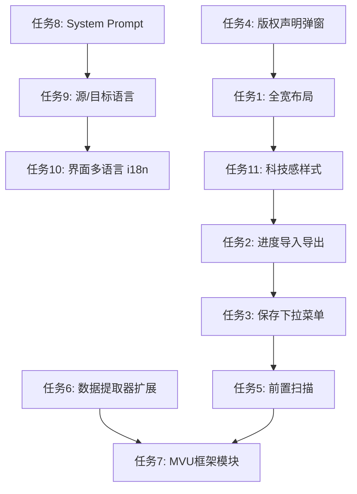

# 翻译功能优化 — 详细开发计划

## 概览

本计划涵盖翻译模块的 11 项重大优化，涉及 UI 改造、功能扩展、数据处理、设置增强和样式升级。

---

## 涉及文件清单

| 文件 | 操作 | 说明 |
|------|------|------|
| `translation/translation-ui.js` | 大量修改 | UI 重构、下拉菜单、扫描功能、多语言、宽度优化 |
| `translation/translation-service.js` | 修改 | System Prompt 改造、源/目标语言支持、术语表注入 |
| `translation/data-extractor.js` | 大量修改 | 新增正则脚本、酒馆助手脚本、MVU 变量的提取与回写 |
| `translation/style.css` | 大量修改 | 科技感样式重构、全宽布局、响应式、下拉菜单样式 |
| `translation/glossary-scanner.js` | **新建** | 前置扫描专有名词、生成术语表 |
| `translation/i18n.js` | **新建** | 翻译模块界面多语言支持（中/英） |
| `settings.js` | 修改 | 版权弹窗、前置 Prompt 输入框、源/目标语言、界面语言 |
| `state.js` | 修改 | 新增设置字段（源语言、目标语言、界面语言、系统 Prompt 等） |
| `translation/png-writer.js` | 无修改 | 保持不变 |

---

## 任务 1：PC端翻译界面全宽 + 移动端响应式优化

### 当前问题
- 翻译对话框使用 `createBaseDialog`，宽度受限于默认对话框尺寸
- 移动端体验未专门优化

### 实施方案
1. 在 `translation-ui.js` 的 `renderMainDialog` 中，对话框打开后通过 JS 将 `.cm-tag-editor`（对话框容器）的宽度设为 `95vw`、`max-width: 1400px`
2. 在 `translation/style.css` 中增加媒体查询：
   - `@media (max-width: 768px)`：翻译条目的原文/译文改为上下排列而非左右
   - 工具栏按钮换行显示
   - textarea 行数自适应

### 具体修改点
- `translation-ui.js` 第 123-136 行：`renderMainDialog` 中调整对话框容器样式
- `translation/style.css`：新增响应式 media query 块

---

## 任务 2：恢复进度改为导入/导出 JSON 文件（hover 下拉菜单）

### 当前问题
- 恢复进度依赖粘贴 HTML 源代码（`showRecoverDialog`），体验差且数据不可靠
- 没有进度导出功能

### 实施方案
1. **导出进度**：将 `currentTranslationData` 序列化为 JSON 文件下载
2. **导入进度**：通过 file input 选择 JSON 文件，反序列化恢复翻译状态
3. **UI 交互**：将原来的 "♻️ 恢复进度" 按钮改为 hover 显示下拉菜单的容器

### 下拉菜单结构
```
♻️ 进度管理 ▾
├── 📥 导入进度 (JSON)
└── 📤 导出进度 (JSON)
```

### 具体修改点
- `translation-ui.js` 第 199-201 行：替换恢复进度按钮为下拉容器
- `translation-ui.js` 第 408-411 行：替换 `showRecoverDialog` 绑定逻辑
- 新增 `exportProgress()` 和 `importProgress()` 函数
- 删除 `showRecoverDialog` 和 `recoverFromHTML` 函数
- `translation/style.css`：新增 `.cm-trans-dropdown` 下拉菜单样式

---

## 任务 3：保存翻译后卡片改为 hover 下拉菜单

### 当前问题
- 当前只有"导出 JSON"和"导出 PNG"两个独立按钮
- 缺少"覆盖原卡"和"直接导入新卡"功能

### 实施方案
1. 将导出按钮合并为一个 hover 下拉菜单
2. 新增两个功能：
   - **覆盖原卡**：调用 ST API `PUT /api/characters/edit` 直接更新角色数据
   - **直接导入新卡**：构建 FormData 调用 `POST /api/characters/import` 创建新角色

### 下拉菜单结构
```
💾 保存卡片 ▾
├── 📝 覆盖原卡 (直接更新)
├── ➕ 导入为新卡
├── 🖼️ 导出 PNG
└── 📄 导出 JSON
```

### 具体修改点
- `translation-ui.js` 第 193-198 行：替换导出按钮为下拉容器
- 新增 `doOverwriteOriginal()` 函数：调用角色编辑 API
- 新增 `doImportAsNew()` 函数：调用角色导入 API
- 需要参考 `index.js` 中的 `saveCharacterData` 和导入逻辑

---

## 任务 4：版权提示和免责声明弹窗

### 实施方案
1. 在 `settings.js` 中，当用户首次开启翻译功能开关时，弹出版权声明对话框
2. 使用 `localStorage` 记录用户是否已接受声明（`cm_translation_disclaimer_accepted`）
3. 已接受过则不再弹出

### 弹窗内容（中英双语）
```
⚠️ 版权提示与免责声明 / Copyright Notice & Disclaimer

中文：
翻译功能仅供个人学习和使用。翻译后的角色卡仅供您自己使用，
禁止二次发布、禁止任何形式的商业使用。请尊重原作者的创作版权。
使用本功能即表示您理解并同意以上条款。

English:
The translation feature is for personal use and learning purposes only.
Translated character cards are strictly for your own personal use.
Redistribution, republication, or any form of commercial use is prohibited.
Please respect the original creator's copyright.
By using this feature, you acknowledge and agree to the above terms.
```

### 接受按钮逻辑
- 接受按钮初始为 disabled，显示 "接受 (5s)" 倒计时
- 5 秒后变为可点击
- 拒绝按钮始终可点击，点击后关闭弹窗且不启用翻译功能

### 具体修改点
- `settings.js` 第 236-241 行：翻译开关的 `onchange` 事件处理
- 新增 `showDisclaimerDialog()` 函数

---

## 任务 5：前置扫描功能（术语表）

### 功能说明
在翻译开始前，先扫描角色卡中的关键位置，提取出需要统一翻译的专有名词（人名、地名、门派名、技能名等），生成术语表供用户编辑确认。

### 实施方案
1. **新建 `translation/glossary-scanner.js`**
2. 扫描范围：
   - 角色名称（name）
   - 世界书标题（character_book entries 的 comment/name）
   - 世界书触发词（keys, secondary_keys）
   - 正则脚本名称（scriptName）
   - 酒馆助手脚本名称和按钮名称
3. 扫描策略：
   - 使用正则提取**大写开头的英文词组**（专有名词特征）
   - 提取**引号包裹的中文词组**
   - 提取**反复出现的实体名称**（通过词频分析）
   - 可选：调用 AI 辅助识别专有名词
4. 术语表 UI：
   - 以表格形式展示（原文 | 建议翻译 | 操作）
   - 用户可编辑建议翻译
   - 确认后的术语表注入到翻译 Prompt 中
5. 术语表持久化：与翻译进度一起导出/导入

### 在翻译界面中的位置
- 工具栏增加 "🔍 扫描专有名词" 按钮
- 点击后弹出术语表编辑对话框
- 确认后术语表显示在工具栏下方

### 术语表注入翻译 Prompt 的方式
```
Translation Glossary (must follow strictly):
- "Shaolin" → "少林"
- "Dali" → "大理"
- "Xiao Feng" → "萧峰"
...
```

---

## 任务 6：数据提取器扩展（正则脚本 + 酒馆助手脚本）

### 当前问题
- `data-extractor.js` 仅提取 basic、system、greetings、tags、lorebook 五个分组
- 不支持 `extensions.regex_scripts` 和 `extensions.tavern_helper`

### 实施方案

#### 新增分组：`regex`（正则脚本）
提取字段：
- `scriptName` — 脚本名称（可翻译）
- `replaceString` 中的**纯文本部分** — 需要从 HTML 模板中提取可翻译文本
  - 注意：`findRegex` **绝对不能翻译**（功能性正则表达式）
  - `replaceString` 中的 HTML 结构/CSS **不能翻译**，仅翻译其中的人读文本

#### 新增分组：`scripts`（酒馆助手脚本）
提取字段：
- `name` — 脚本名称
- `info` — 脚本备注说明
- `button.buttons[].name` — 按钮名称
- `content` 中的**纯文本部分** — 需特别处理：
  - JS 代码中的字符串字面量（如 `toastr.info('心有所属')` 中的中文）
  - HTML 模板中的显示文本
  - 注意：变量名、函数名、代码逻辑**不能翻译**

#### 数据回写
在 `applyTranslation` 函数中增加对 `regex` 和 `scripts` 分组的回写逻辑。

### 关键风险点
- replaceString 中的 HTML 结构不能被破坏
- 脚本代码中的变量引用不能被翻译
- 需要精确的文本提取策略（正则匹配中文/英文文本片段）

---

## 任务 7：MVU 框架专属翻译模块

### 分析结果
从样例角色卡可以看出 MVU 框架的核心特征：

1. **Schema 定义脚本**（`变量结构`）：使用 `z.object({})` 定义变量结构
   - 字段名是中文（如 `时间`、`地理`、`武学`）
   - `.describe()` 中有描述文本
   - `.prefault()` 中有默认值
   
2. **状态栏脚本**（`[界面]状态栏`）：通过 `_.get(vars, '时间.朝代')` 引用变量
   - 变量引用路径必须与 Schema 定义**严格对应**

3. **风险**：如果翻译了 Schema 中的字段名，必须同步更新所有脚本中的 `_.get(vars, ...)` 引用路径

### 实施方案
1. **检测 MVU 框架**：扫描 `tavern_helper.scripts` 是否包含 MVU 相关 import
2. **提取 Schema 字段名**：解析 `z.object({})` 结构，提取字段名和 describe 文本
3. **建立引用映射**：扫描所有脚本内容中对变量路径的引用（如 `_.get(vars, '...')`、`getAllVariables()` 等）
4. **联动翻译**：
   - 用户翻译 Schema 字段名时，自动在所有引用位置生成对应的替换
   - 或者建议用户**不翻译变量名**，仅翻译 `.describe()` 描述文本和 UI 显示文本
5. **安全策略**：
   - 默认将 MVU Schema 字段名标记为"不建议翻译"（显示警告图标）
   - `.describe()` 和 `.prefault()` 中的文本标记为"安全翻译"
   - UI 模板中的显示文本标记为"安全翻译"

### 这是一个高复杂度功能，建议分两阶段：
- **阶段一**（本次）：检测 MVU 框架、提取安全可翻译的文本（describe、prefault、UI文本），变量名默认锁定不翻译
- **阶段二**（后续）：实现变量名联动翻译（风险较高，需更多测试）

---

## 任务 8：设置界面增加前置提示词输入框

### 当前状态
- `translation-service.js` 第 67-78 行已有 `getSystemPrompt()` 方法
- 已有 `translationPrompt` 设置字段，但在设置界面中只是翻译对话框内的折叠区域

### 实施方案
1. 在设置界面的翻译详细设置区域（`#cmTransSettings`）增加 System Prompt 输入框
2. 内置一个专业的初始 Prompt：

```
你是一名专业的角色扮演内容翻译专家。请遵循以下规则：

1. 保持角色的语气、风格和个性特征不变
2. 保留所有格式标记（如 {{user}}、{{char}}、<start>、```html 等）
3. 不翻译代码、变量名、HTML标签、CSS属性
4. 专有名词（人名、地名、技能名）优先使用术语表中的译法
5. 如原文为目标语言，则保持不变
6. NSFW 内容需准确翻译，使用恰当的术语
7. 仅输出翻译后的 JSON 对象，不要添加任何解释
```

3. 将原翻译界面中的"自定义翻译指导"折叠区改为引用设置中的 Prompt（可在翻译界面临时修改，不持久化）

### 具体修改点
- `settings.js` 第 127-158 行：翻译设置区域增加 textarea
- `state.js` 第 28 行：`translationPrompt` 默认值改为内置 Prompt
- `translation-service.js` 第 65-78 行：`getSystemPrompt()` 整合源/目标语言

---

## 任务 9：设置界面增加源语言和目标语言

### 实施方案
1. 在 `state.js` 的 `defaultSettings` 中新增：
   - `sourceLanguage: 'auto'`（自动检测、English、Japanese、Korean 等）
   - `targetLanguage: 'zh-CN'`（简体中文、繁体中文、English、Japanese 等）
2. 在设置界面增加两个下拉选择器
3. 在 `translation-service.js` 的 `getSystemPrompt()` 中注入语言指令

### 语言选项列表
```
源语言：自动检测 | English | 日本語 | 한국어 | 简体中文 | 繁體中文
目标语言：简体中文 | 繁體中文 | English | 日本語 | 한국어
```

---

## 任务 10：翻译模块界面语言选项

### 实施方案
1. **新建 `translation/i18n.js`**：导出所有翻译模块 UI 文本的中英文映射
2. 在 `state.js` 新增 `uiLanguage: 'zh-CN'` 设置
3. 在设置界面增加界面语言选择器
4. 翻译模块的所有 UI 文本通过 `i18n.t('key')` 函数获取
5. **仅翻译模块**支持多语言，插件其他模块保持中文

### i18n 映射示例
```js
export const translations = {
  'zh-CN': {
    'toolbar.translateSelected': '🌍 翻译选中',
    'toolbar.translateAll': '🚀 翻译全部未完成',
    'toolbar.scanGlossary': '🔍 扫描专有名词',
    'group.basic': '📋 基础信息',
    ...
  },
  'en': {
    'toolbar.translateSelected': '🌍 Translate Selected',
    'toolbar.translateAll': '🚀 Translate All Pending',
    'toolbar.scanGlossary': '🔍 Scan Proper Nouns',
    'group.basic': '📋 Basic Info',
    ...
  }
};
```

---

## 任务 11：界面样式科技感升级

### 设计方向
- 深色主题为主，增加**赛博朋克/科技感**元素
- 使用渐变色边框、发光效果、半透明磨砂背景
- 翻译状态使用脉冲动画（loading 状态）
- 按钮增加微妙的 hover 发光效果

### 具体样式改造

1. **整体容器**：
   - `background: linear-gradient(135deg, rgba(15,15,25,0.95), rgba(20,20,35,0.98))`
   - `border: 1px solid rgba(56, 189, 248, 0.2)`
   - `backdrop-filter: blur(10px)`

2. **工具栏**：
   - 底部发光线条：`border-bottom: 1px solid rgba(56, 189, 248, 0.3)`
   - 按钮：`background: rgba(56, 189, 248, 0.1); border: 1px solid rgba(56, 189, 248, 0.3)`
   - hover 效果：`box-shadow: 0 0 12px rgba(56, 189, 248, 0.3)`

3. **分组卡片**：
   - 头部渐变：`background: linear-gradient(90deg, rgba(56,189,248,0.1), transparent)`
   - 展开/折叠动画

4. **翻译条目**：
   - 翻译中状态：边框脉冲动画（蓝色呼吸灯效果）
   - 成功状态：绿色发光边框
   - 失败状态：红色发光边框
   - 原文区域：半透明暗色背景
   - 译文区域：略亮的输入背景

5. **下拉菜单**：
   - 磨砂背景 + 发光边框
   - 选项 hover 高亮效果

6. **移动端适配**：
   - 所有发光效果在移动端减弱（节省性能）
   - 字体大小适配

---

## 实施顺序建议



**建议分三个批次实施：**

### 第一批：基础设施（任务 4, 8, 9, 10）
- 版权声明弹窗
- System Prompt 和语言设置
- i18n 国际化基础

### 第二批：UI 改造（任务 1, 2, 3, 11）
- 全宽布局 + 响应式
- 下拉菜单交互
- 科技感样式

### 第三批：高级功能（任务 5, 6, 7）
- 前置扫描术语表
- 正则/脚本数据提取
- MVU 框架支持

---

## 风险评估

| 风险 | 等级 | 缓解措施 |
|------|------|----------|
| MVU 变量名翻译导致功能断裂 | 🔴 高 | 阶段一默认锁定变量名不翻译 |
| 正则 replaceString 中 HTML 被破坏 | 🟡 中 | 精确提取纯文本，保留 HTML 结构 |
| 脚本代码中的字符串提取误伤 | 🟡 中 | 保守策略：仅提取明确的 UI 文本 |
| 覆盖原卡导致数据丢失 | 🟡 中 | 操作前强制确认 + 建议先导出备份 |
| 大量 CSS 修改导致样式冲突 | 🟢 低 | 使用 `.cm-trans-` 前缀隔离 |